### 1 分布式架构原理
#### 1.1 分布式架构的演进过程
**==集群：==** 是一种较新的技术，通过集群技术，可以在付出较低成本的情况下获得在性能、可靠性、灵活性方面的相对较高的收益，其任务调度则是集群系统中的核心技术。
集群是一组相互独立的、通过高速网络互联的计算机，它们构成了一个组，并以单一系统的模式加以管理。一个客户与集群相互作用时，集群像是一个独立的服务器。集群配置是用于提高可用性和可缩放性。
集群就是逻辑上处理同一任务的机器集合，可以属于同一机房，也可分属不同的机房。

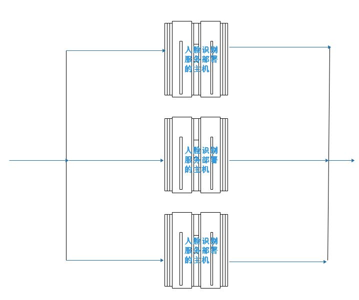

**==分布式：==** 所谓分布式计算是一门计算机科学，它研究如何把一个需要非常巨大的计算能力才能解决的问题分成许多小的部分，然后把这些部分分配给许多计算机进行处理，最后把这些计算结果综合起来得到最终的结果。分布式网络存储技术是将数据分散地存储于多台独立的机器设备上。分布式网络存储系统采用可扩展的系统结构，利用多台存储服务器分担存储负荷，利用位置服务器定位存储信息，不但解决了传统集中式存储系统中单存储服务器的瓶颈问题，还提高了系统的可靠性、可用性和扩展性。
分布式是相对中心化而来，强调的是任务在多个物理隔离的节点上进行。中心化带来的主要问题是可靠性，若中心节点宕机则整个系统不可用，分布式除了解决部分中心化问题，也倾向于分散负载，但分布式会带来很多的其他问题，最主要的就是一致性。

最简单的分布式架构：通过负载均衡服务支持多个web服务器，这些web服务器通过一个公用的缓存服务器来保存必要的临时状态，并共享同一个数据库。

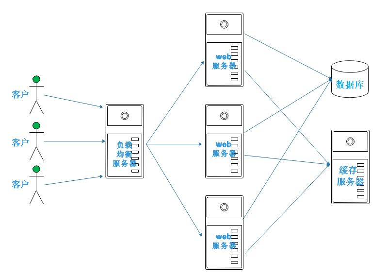

**==注： #fc0606==** 

分布式：不同的业务模块部署在不同的服务器上或者同一个业务模块分拆多个子业务，部署在不同的服务器上，解决高并发的问题。
集群：同一个业务部署在多台机器上，提高系统可用性。
所以说分布式架构中可能有集群，单集群不等于有分布式。
##### 1.1.1 分布式架构中的概念
**==节点： #009688==** 指的是可以独立按照分布式协议完成一组逻辑的程序个体。在项目的具体表现上表示为一个操作一同上运行的目标进程。

**==副本： #009688==** 指的是在分布式系统中为数据或服务提供冗余的功能。其中包括数据副本和服务副本。
- 数据副本：指在不同的节点上持久化同一份数据,当出现某一个节点的数据丢失时,可以从副本读取数据。它是分布式系统中结果数据丢失恢复的唯一手段。
- 服务副本：指的是多个节点提供相同的服务，通过主从关系来实现服务的高可用方案。

**==中间件： #009688==**  其位与操作系统提供的服务之外,又不属于应用,它是位与应用和系统层之间为开发者方便的处理通信,输入和输出的一类软件,能够让用户关心自己应用的一部分。
### 2 单机系统扩展为分布式系统
这里用一个智慧楼宇产品的架构分析展开。
#### 2.1 单机服务器应用
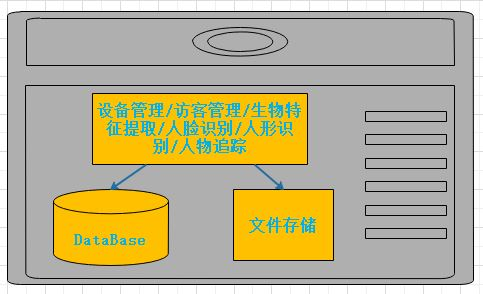
#### 2.2 应用服务同数据库及文件存储服务分离
随着流量的增大，当服务器的性能受到挑战，为缓解这个问题，将应用同数据库及文件存储服务分离。

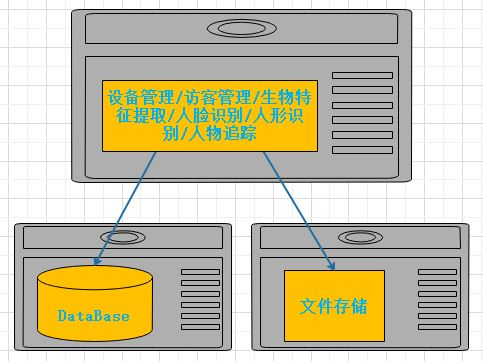
#### 2.3 应用服务器集群
当流量增大到一定程度的时候，单个应用服务器的处理能力完全被占据了，这时候通过应用服务集群的方式来缓解应用服务器的承受压力。

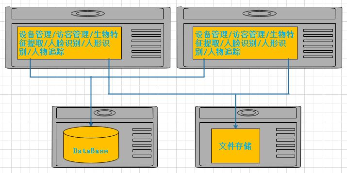
#### 2.4 负载均衡器的插入
当用户的流量请求得到缓解。 用户的管理及请求的转发等问题出现了，这时候通过负载均衡器来分流.

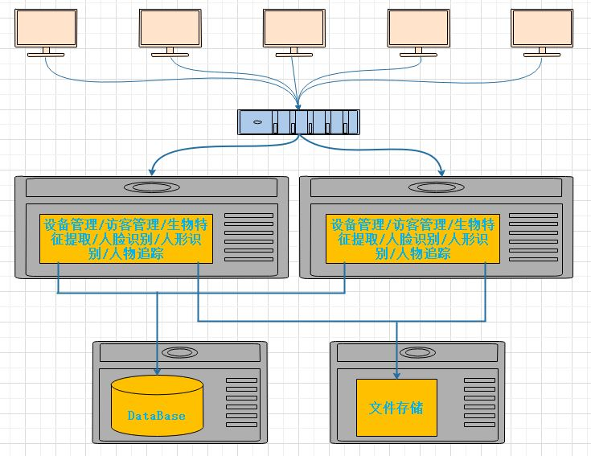
#### 2.5  数据库及文件存储服务器集群
负载均衡器的加入解决了新一轮的流量压力，这时候数据库的操作及文件的存储出现性能压力，二者遇到瓶颈。这时候通过集群的技术来解决。

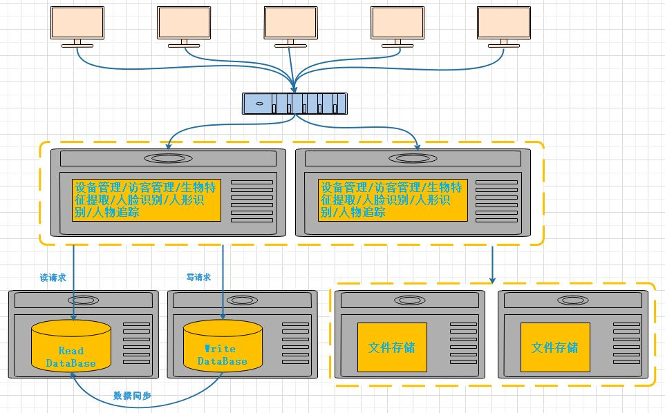
#### 2.6  缓存服务器的介入
流量的压力通过集群解决后，服务器处理的过程中一些公共数据及必要的算法和处理参数的读取操作会影响服务的执行效率，通过缓存服务器的介入来解决。

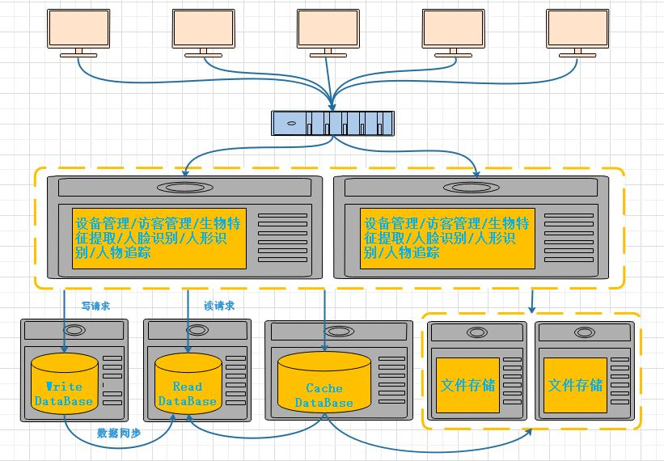
#### 2.7  数据库水平/垂直拆分
 数据库的水平拆分是根据服务的类别进行拆分，而数据库的水平拆分是将单服务的数据分库分表。
 
 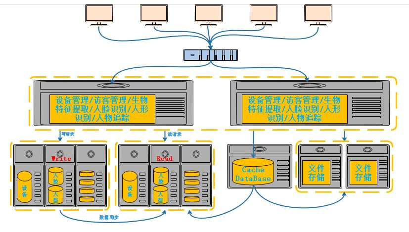

 #### 2.7  应用的垂直拆分
系统的持续扩大以及实施的环境不同给整个系统的安装、部署、维护带了了很多不便之处，通过拆分应用系统来解决。

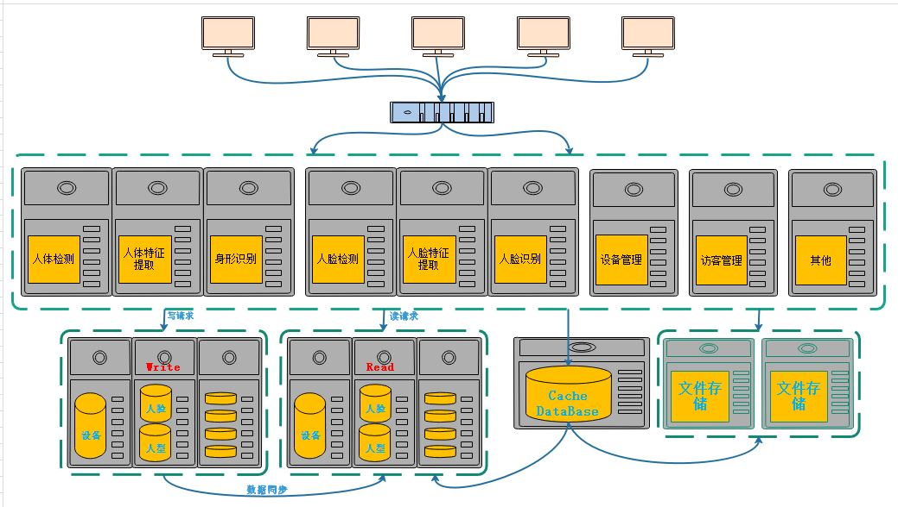
 #### 2.7  分布式架构
 应用垂直拆分后也带来了应用模块相互间交互困难的问题。通过添加服务中心来解决。
 
 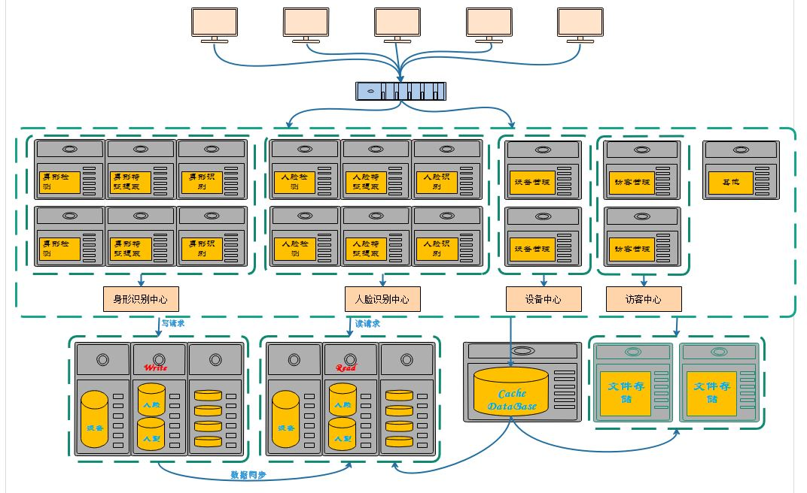