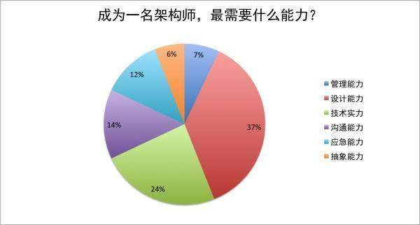
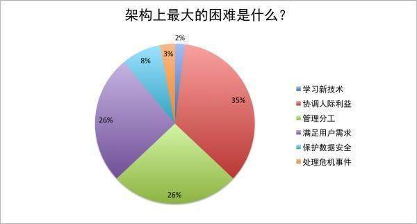

### ==基础能力 #009688==
 - 出色的设计能力
 - 扎实的编程能力
 - 良好的沟通能力
### ==主要职责 #009688==
 - 制定技术规格说明
 - 确认需求
 - 技术选型
 - 系统分解

==**确认需求：**== 架构师要懂得用户需求，理解用户真正想要什么，这使得架构师必须要和分析人员不断沟通，反复确认需求规格说明书，以此来保证他精准清楚用户需求。架构设计的目的很明确，目的是什么呢？挖掘用户需求。

==**系统分解：**== 在架构师认可需求规格说明书后，明确用户的需求后就是需求的分解了，分解一般分为纵向分解和横向分解。纵向分解是将整个系统分层，从而将整体系统分解成下一级的子系统与组件。横向分解是在系统分解成不同的逻辑层或服务后，对逻辑层进行分块，确定层与层之间的关系。

==**技术选型：**== 在系统分解后，架构师会最终形成软件整体架构，接下来，架构师的职责是技术选型。架构师在技术选型阶段会提供参考信息给项目经理，项目经理再从预算、进度、人力、资源等各方面情况来权衡，最终确认。

==**制定技术规格说明：**== 架构师在项目开发过程中是「灵魂人物」，并且要具备协调组织能力和懂得人员分工。在制定技术规格说明阶段，架构师要协调起所有的开发人员，架构师通常会用技术规格说明书与开发人员保持沟通，让开发人员能从各个视角去观测、理解他们负责的模块或者子系统，确保开发人员能够按照架构意图实现各项功能。

### ==能力分析 #009688==

### ==困难及挑战 #009688==

### ==JAVA架构师修炼体系 #009688==

 - 熟悉常用设计模式
		 1.代理模式
		 2.工厂模式(简单工厂、工厂方法、抽象工厂)
		 3.单例模式
		 4.策略模式
		 5.原型模式
		 6.模板模式
		 [点击 知识点链接](https://github.com/diandian521/Design-Mode)
 - spring
		 1.IOC容器设计原理及高级特性
		 2.AOP设计原理
		 3.Spring事务处理机制
		 4.基于SpringJDBC手写ORM框架
		 5.springMVC九大组件
 - MyBatis
		 1.代码自动生成器
		 2.MyBati关联查询、嵌套查询
		 3.缓存使用场景及策略
		 4.Mybatis的事务
		 5.Mybatis动态代理的实现
 - 分布式架构原理
		 1.分布式架构演进过程
		 2.如客人将单机扩展为分布式系统
		 3.CDN加速静态文件访问
		 4.系统监控、容灾、存储动态扩展
		 5.架构设计及业务驱动划分
		 6.CAP、Base理论及其应用
 - 分布式架构策略
		 1.分布式架构网络通信原理
		 2.通信协议中的序列化与反序列化
		 3.基于框架的RPC技术Webservice/RMI/Hessian
		 4.Zookeeper在disconf配置中心的应用
		 5.基于Zookeeper实现分布式服务器动态上下线感知
		 6.Dubbo管理中心及监控平台的安装部署
		 7.Dubbo分布式架构机器容错机制及高扩展性分析
 - 分布式架构中间件
		 1.分布式消息通信ActiveMQ/kafka/RabbitMQ
		 2.Redis主从赋值原理及无磁盘辅助分析
		 3.图解Redis中AOF和RDB持久化策略的原理
		 4.MonggoDb企业级集群解决方案
		 5.MonggoDb数据分片、转存及恢复策略
		 6.Netty
 - 微框架
		 1.与微服务之间的关系
		 2.热部署
		 3.核心组件Starter、Actuator、AutoConfiguration
		 4.集成Mybatis实现多数据源路由实战
		 5.集成Dubbo实战
		 6.集成Redis缓存实战
		 7.集成Swagger构建API管理及测试体系
		 8.实现多环节配置动态解析
 - Spring Cloud
		 1.Eureka注册中心
		 2.Ribbon集成REST实现负载均衡
		 3.Fegion申明式服务调用
		 4.Zuui实现微服务网格
		 5.Config分布式统一配置中心
		 6.Bus信息总线
		 7.基于Hystrix实现接口降级
		 8.集成Spring Cloud实现统一整合方案
 - Docker虚拟化
		 1.Docker的镜像、仓库、容器
		 2.Docker网络组成、路由互联、openvswitch
		 3.基于Swarn构建Docker集群实战
		 4.Kubernetes
 - 微服务架构	
		  1.SOA架构与微服务架构的区别于联系
		  2.如何设计微服务架构及设计原则
		  3.解惑spring boot流行因素及能解决什么问题
 - 性能优化
		1.性能基准
		2.性能优化到底是什么
		3.衡量纬度
 - JVM原理及调优
		 1.JVM定义及其原理
		 2.详解JVM运行数据区
		 3.详解JVM内存模型JMM
		 4.详解GC可达
		 5.详解各种垃圾回收器使用场景
 - Tomcat调优
		1. tomcat的运行机制及原理
		2.分析Tomcat线程模型
		3.Tomcat系统参数认识及调优
		4.基准测试
 - Maven
 - Jenkins
 - Git
		 1.Git定义及工作原理
		 2.Git常用命令Best Practise
		 3.Git冲突起因及解决方式
		 4.架构师的职责：Git Flow规范团队Git使用规范
 - 并发基础及框架
		 1.线程的起源、优势、实现
		 2.共享内存、缓存一致性、MES协议
		 3.自旋锁、偏向锁、重量级锁
		 4.一致性模型
		 5.JMM内存模型
		 6.核心机制AQS
		 7.重入锁ReetrantLock
		 8.线程锁synchronized及Locks
		 9.并发工具类CountDownLatch
		 10.线程安全集合CouncurrentHashMap
		 11.线程实现、线程池及原理
 - 用户认证
		 1.用户注册
		 2.SSO单点登录
		 3.第三方登录
		 4.UI页面拦截
		 5.业务拦截
 - 消息推送
		 1.融云推送
		 2.消息中间键
		 3.用户群聊
		 4.点对点聊天
		 5.文件断点续传